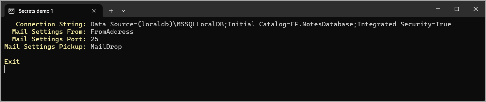

# About

An example of using a class project for models, and another class project is responsible for secrets.

The project SecretsLibrary1 has secrets which are used in this project.

## Before running

Initialize (manage user secrets) in SecretsLibrary1 with the contents of UserSecrets.md

Right-click on the project in Visual Studio and select `Manage User Secrets` to open the secrets file then populate it with the contents of `UserSecrets.md`.

