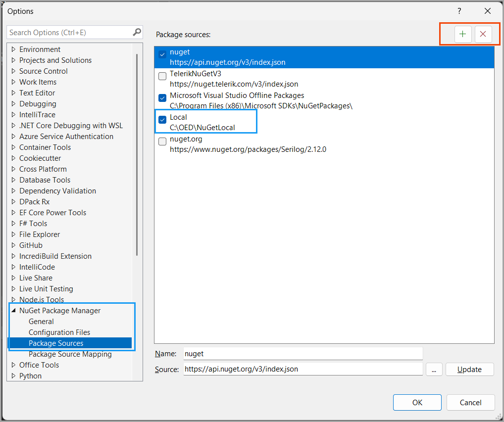

# About

This project uses TeamsSecretsLibrary as a local package. 

# How to use

- Create a folder to store local NuGet packages.
- Build the TeamsSecretsLibrary project.
- Copy `TeamsSecretsLibrary.1.0.0.nupkg` to the local packages folder.
- Add the local package by select `Package source local`

